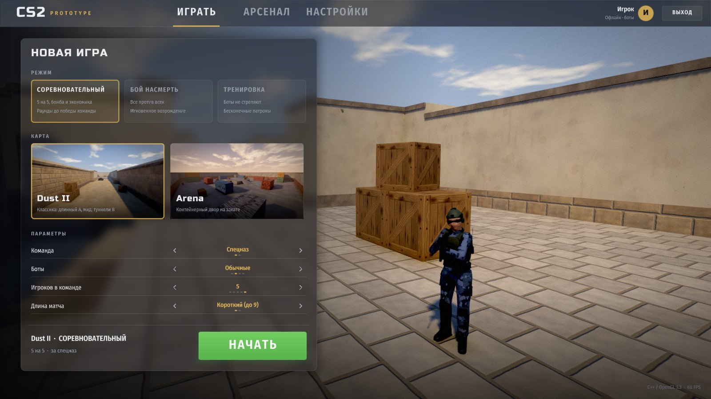
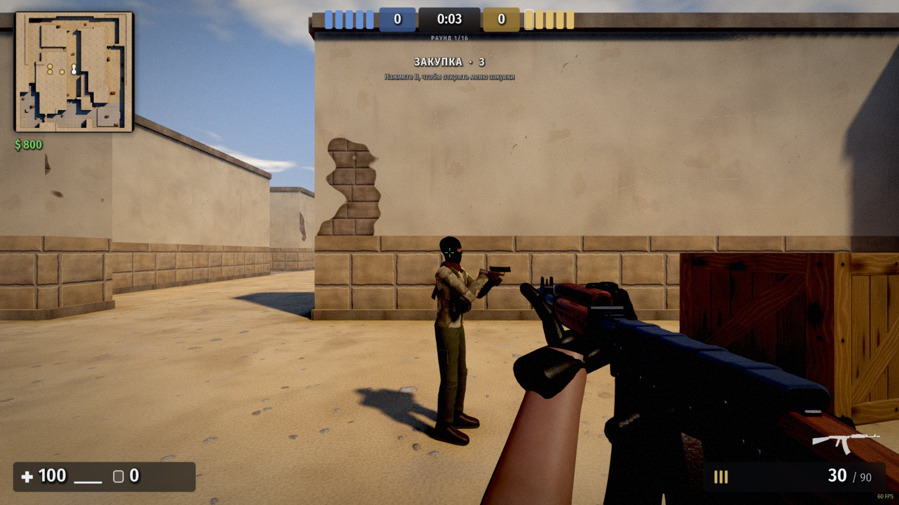

# CS2 Prototype — шутер в стиле Counter-Strike 2 на C++

Прототип тактического шутера с **собственным движком** на C++17 и OpenGL 3.3: рендерер, физика, анимация, ИИ, интерфейс и звук написаны с нуля. Внешние библиотеки используются только для окна/ввода (GLFW), загрузки функций OpenGL (glad), растеризации шрифтов (stb_truetype), сохранения скриншотов (stb_image_write) и вывода звука на устройство (miniaudio).




## Что есть

**Графика**
- HDR-рендеринг, PBR-освещение (GGX), тени от солнца с PCF, MSAA, bloom, тонмаппинг ACES, цветокоррекция, виньетка.
- Запечённое освещение карт при загрузке (небо + отражённый свет солнца + ambient occlusion), многопоточно, с BVH.
- Световые пробы для моделей (игроки и оружие темнеют в туннелях), процедурное небо с облаками.
- 12 процедурных материалов с картами нормалей (песок, песчаник, штукатурка, плитка, ящики, крашеные двери, металл, бетон, кирпич, профлист, брусчатка).
- Частицы (дульные вспышки, пыль/искры по типу поверхности, кровь, дым, взрывы), декали от пуль, трассеры, динамический свет.

**Физика**
- Движение как в Source/CS2: трение и ускорение CS2, стрейфы и распрыжка в воздухе, ступеньки, рампы, прыжок с приседом.
- Мир из выпуклых брашей, BVH и трассировка «коробка через браш» (как в Quake/Source).
- Пули с разбросом (зависит от движения, прыжка, приседа), паттерны отдачи AK-47/M4A4, пробитие стен, броня и хитгруппы (голова ×4).
- Рэгдоллы (Верле) с коллизией о мир, гранаты с отскоками, гильзы и выброшенное оружие с физикой.

**Модели и анимация**
- Все модели генерируются в коде: AK-47, M4A4, AWP, Desert Eagle, USP-S, Glock-18, нож, гранаты, C4, руки T/CT, агенты T и CT.
- Подвижные части оружия: магазин, затвор/слайд, рукоять затвора AWP.
- **Руки ставятся через двухзвенный IK на точки хвата оружия**, пальцы — по фалангам с позами хвата. Поэтому кисти остаются на рукояти, цевье и магазине во всех анимациях: доставание, отдача, перезарядка, осмотр (F), передёргивание затвора AWP, удары ножом, бросок гранаты.
- Покачивание при ходьбе, инерция при повороте мыши, пружина при приземлении. FOV и пресеты положения оружия как в CS2.

**Игра**
- Режимы: «Соревновательный» (5×5, бомба, раунды, экономика CS2, короткий/длинный матч), «Бой насмерть», «Тренировка» (боты не стреляют, бесконечные патроны).
- Карты: **Dust II** (лонг, мид с дверями, кэтвок, туннели B, платформа A) и **Arena** (контейнерный двор на закате).
- Боты: поле зрения, линия видимости, слух, дым и ослепление блокируют обзор, реакция и ошибка прицела по сложности (4 уровня), контроль отдачи, очереди на дистанции, стрейфы, навигация A* по автоматической сетке, закладка/разминирование, закупка.
- Меню закупки, выпадение оружия, подбор, установка и обезвреживание C4, гранаты HE / дымовая / световая.

**Интерфейс и звук**
- Лобби в стиле CS2 с живым 3D-фоном и агентом, выбор режима/карты/команды/ботов, «Арсенал» с 3D-просмотром оружия и характеристиками, настройки (мышь, графика, звук, редактор прицела с предпросмотром).
- HUD: здоровье/броня, патроны, таймер, счёт и живые игроки, вращающийся радар, килфид с иконками (хедшот, прострел), индикаторы урона, прицел AWP, таблица счёта (Tab), наблюдение после смерти.
- Процедурно синтезированные звуки с 3D-панорамой: выстрелы по типам оружия, шаги, попадания, «динь» по шлему, взрывы, писк C4.

## Сборка

### Готовая сборка для Windows
GitHub Actions собирает игру на каждом PR и коммите в `main`. Во вкладке **Actions** откройте последний успешный запуск **Build** и скачайте артефакт `cs2proto-windows-x64`, распакуйте и запустите `cs2proto.exe` (папка `assets` должна лежать рядом). Visual C++ Redistributable не нужен.

Нужны CMake 3.16+, компилятор C++17 и доступ в интернет при первой конфигурации (CMake скачает GLFW 3.5.1 и miniaudio 0.11.25 с проверкой SHA-256).

### Windows (Visual Studio 2022)
```bat
cmake -S . -B build
cmake --build build --config Release
build\Release\cs2proto.exe
```
Или откройте папку в Visual Studio как CMake-проект и запустите цель `cs2proto`.

### Linux
```bash
sudo apt install build-essential cmake libx11-dev libxrandr-dev libxinerama-dev libxcursor-dev libxi-dev libgl-dev
cmake -S . -B build -DCMAKE_BUILD_TYPE=Release
cmake --build build -j
./build/cs2proto
```
Сборка для Windows из Linux: `cmake -S . -B build-win -DCMAKE_TOOLCHAIN_FILE=cmake/mingw-w64.cmake && cmake --build build-win`.

Папка `assets` копируется рядом с исполняемым файлом автоматически. Без звукового устройства игра запускается без звука. Сборка без звука: `-DCS2P_AUDIO=OFF`.

## Управление

| Клавиша | Действие |
|---|---|
| WASD, Пробел, Ctrl, Shift | движение, прыжок, присесть, шаг |
| ЛКМ / ПКМ | огонь / прицел AWP, тяжёлый удар ножом |
| R, F, G | перезарядка, осмотр оружия, выбросить |
| 1–5, колесо, Q | выбор оружия, предыдущее оружие |
| E | заложить / обезвредить бомбу |
| B, Tab, Esc | закупка, таблица счёта, пауза |

## Автоматические скриншоты

Игру можно запустить без участия человека, например для проверки на CI:
```bash
./cs2proto --shot lobby.png --scene lobby
./cs2proto --shot game.png --scene game --map dust --team t --weapon ak47 --sim 20
./cs2proto --shot reload.png --scene game --weapon m4a4 --anim reload@0.4 --pos 0,-1300,1 --ang 0,90
```
Параметры: `--scene lobby|game`, `--tab`, `--settings-tab`, `--map dust|arena`, `--mode comp|dm|practice`, `--team ct|t`, `--weapon <ak47|m4a4|awp|deagle|usp|glock|knife|he|smoke|flash|c4>`, `--sim <секунды>`, `--anim reload|inspect|fire|deploy|slash|stab|bolt|throw@<t>`, `--overlay buy|pause`, `--fire`, `--frames`, `--size WxH`.

## Структура

```
src/core      математика, шум, настройки
src/platform  окно и ввод (GLFW)
src/gfx       рендерер, шейдеры, GL-утилиты
src/assets    процедурные текстуры, генератор мешей, модели оружия и рук
src/world     брашы и коллизии (BVH), конструктор карт, запекание света, навигация, карты
src/game      движение, оружие, вьюмодель, агенты и рэгдолл, эффекты, правила матча, боты
src/ui        SDF-шрифты, 2D-рендерер, виджеты, лобби, HUD
src/audio     микшер и синтез звуков
```

Настройка положения оружия в кадре — `viewHold` в `src/assets/weapon_models.cpp`; точки хвата рук — `rightGrip` / `leftGrip` там же, стойка плеч — `shoulderR` / `shoulderL`.

## Ограничения прототипа

- Только одиночная игра с ботами, без сети. Нет смены сторон в середине матча.
- Модели и звуки процедурные: оригинальные ассеты CS2 защищены авторским правом и не используются.
- Проверено: сборка и запуск на Linux (Mesa llvmpipe), сборка под Windows через MSVC (CI) и MinGW. Запуск на реальной видеокарте под Windows и сборка на macOS не проверялись.

Шрифты Fira Sans Condensed и Russo One распространяются по лицензии SIL OFL (см. `assets/fonts`), stb — public domain / MIT, glad — сгенерированный код (MIT/Apache 2.0 для спецификаций Khronos).
